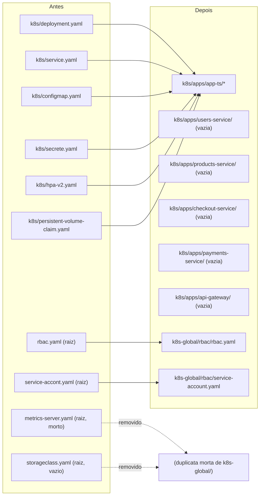

# Spec: Organização de pastas para suportar múltiplos microsserviços

## Contexto

O repositório `kubernets-app` foi criado como material de estudo de Kubernetes em torno de uma única aplicação (`app-ts`): um `Deployment`, `Service`, `ConfigMap`, `Secret`, `HPA` e `PersistentVolumeClaim`, todos soltos direto na pasta `k8s/`. Recursos de escopo de cluster (não ligados a nenhuma aplicação específica) já ficavam separados em `k8s-global/` (`metrics-server`, `storageclass`, `persistent-volume`).

Agora o projeto de estudo `marketplace-microservicos` (múltiplos serviços NestJS: `api-gateway`, `users-service`, `products-service`, `checkout-service`, `payments-service`) passa a ser o alvo dos manifests deste repositório. A pasta `k8s/` no formato atual (arquivos soltos = um único app) não comporta mais de um serviço sem colisão de nomes de arquivo.

Além disso, a raiz do repositório acumulou arquivos que não deveriam estar soltos ali:
- `metrics-server.yaml`: cópia integralmente comentada (não-funcional) do arquivo real, que já existe em `k8s-global/metrics-server.yaml`.
- `storageclass.yaml`: arquivo vazio (0 bytes), também superado pela versão real em `k8s-global/storageclass.yaml`.
- `rbac.yaml` e `service-accont.yaml`: manifests de estudo de RBAC (Role/RoleBinding/ClusterRole e ServiceAccount+Role+RoleBinding) que não pertencem a nenhum app específico, mas também não estavam organizados como recurso de cluster.

## Objetivo

Reorganizar a estrutura de pastas do `kubernets-app` para que cada microsserviço tenha seu próprio diretório de manifests, sem introduzir nenhuma ferramenta ou conceito novo (sem Kustomize, Helm ou Namespace dedicado — fora do escopo de estudo atual), e eliminar os arquivos duplicados/mortos da raiz.

## Requisitos Funcionais

### RF01 — Isolar os manifests do `app-ts` em pasta própria
Mover os manifests hoje soltos em `k8s/` para `k8s/apps/app-ts/`, mantendo o conteúdo idêntico (apenas corrigindo o nome do arquivo de secret, ver RF05).

### RF02 — Criar a pasta de cada novo microsserviço
Criar, vazias por enquanto (com `.gitkeep`), as pastas `k8s/apps/<serviço>/` para `users-service`, `products-service`, `checkout-service`, `payments-service` e `api-gateway` — mesmos nomes de pasta usados no `marketplace-microservicos`. O conteúdo de cada uma é definido em specs futuras, uma de cada vez.

### RF03 — Consolidar manifests de RBAC de estudo
Mover `rbac.yaml` e `service-accont.yaml` (raiz) para `k8s-global/rbac/`, já que são recursos de escopo de cluster (Role/ClusterRole/ServiceAccount), não específicos de nenhum app.

### RF04 — Remover duplicatas mortas da raiz
Remover `metrics-server.yaml` (raiz) e `storageclass.yaml` (raiz): ambos são superados pelas versões reais e funcionais já existentes em `k8s-global/`.

### RF05 — Corrigir nomes de arquivo com erro de digitação
- `k8s/secrete.yaml` → `k8s/apps/app-ts/secret.yaml`
- `service-accont.yaml` → `k8s-global/rbac/service-account.yaml`

## Estrutura de Pastas (antes/depois)

## Fora de Escopo

- Conteúdo dos manifests de cada novo microsserviço (Deployment, Service, ConfigMap, Secret, HPA) — cada um é uma spec própria, a partir da spec 02.
- Qualquer mudança em `tf/` (terraform).
- Kustomize, Helm, ou criação de um Namespace dedicado — permanece tudo no padrão de recursos já conhecido (Deployment/Service/ConfigMap/Secret/HPA/PVC), sem namespace explícito, igual ao `app-ts` hoje.
- Reorganização do repositório `marketplace-microservicos` (código de aplicação) — fora do escopo deste repositório de infra.
- O arquivo `CLAUDE.md` solto na raiz do `kubernets-app` (conteúdo pertence ao `marketplace-microservicos`) — fica para decisão em separado.

## Critérios de Aceite

1. `k8s/apps/app-ts/` contém os 6 arquivos de manifest do `app-ts` (`deployment.yaml`, `service.yaml`, `configmap.yaml`, `secret.yaml`, `hpa-v2.yaml`, `persistent-volume-claim.yaml`), com o mesmo conteúdo de antes.
2. `k8s/` não tem nenhum arquivo solto na raiz — só a subpasta `apps/`.
3. `k8s/apps/users-service/`, `products-service/`, `checkout-service/`, `payments-service/` e `api-gateway/` existem (vazias, com `.gitkeep`).
4. `k8s-global/rbac/` contém `rbac.yaml` e `service-account.yaml`.
5. A raiz do `kubernets-app` não tem mais `metrics-server.yaml`, `storageclass.yaml`, `rbac.yaml` nem `service-accont.yaml` soltos.
6. `kubectl apply -f k8s/apps/app-ts/` continua aplicando o `app-ts` exatamente como antes (nenhum conteúdo de manifest foi alterado, só localização/nome de arquivo).

## Referências

- Padrão de spec: `marketplace-microservicos/products-service/docs/specs/01-scaffold.md`
- Estrutura de pastas do projeto de aplicação, usada como referência de nomes de serviço: `marketplace-microservicos/README.md`
