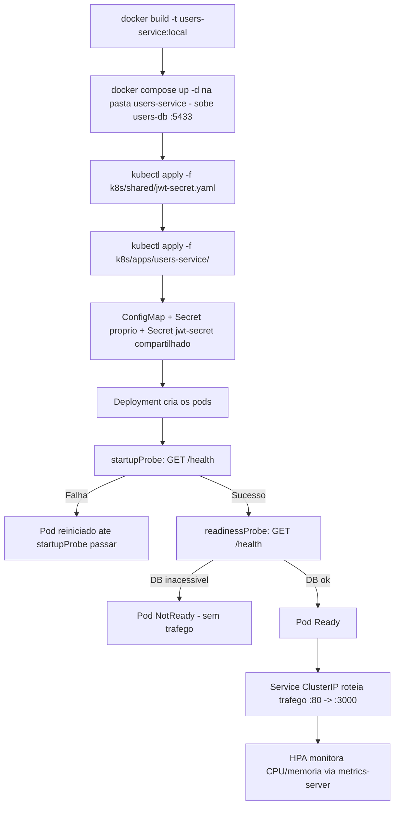

# Spec: Deploy piloto do users-service no cluster local

## Contexto

A spec 01 já criou a pasta `k8s/apps/users-service/` (vazia) como parte da reorganização para múltiplos microsserviços. Esta spec define o conteúdo dela: o primeiro serviço do `marketplace-microservicos` a rodar de fato no cluster, servindo de piloto pro padrão que depois será replicado para `products-service`, `checkout-service`, `payments-service` e `api-gateway`.

O `users-service` é NestJS + TypeORM, escuta na porta `3000`, e seu `docker-compose.yaml` sobe um Postgres 15 (`users-db`, database `users_db`, usuário/senha `postgres`/`postgres`) exposto em `localhost:5433`. Ele expõe um único endpoint de saúde, `GET /health`, que já inclui verificação de conexão com o banco (`TypeOrmHealthIndicator.pingCheck`) — diferente do `api-gateway`, não existe hoje um endpoint de liveness separado (`/health/live`) que não dependa de infraestrutura externa.

O cluster local em uso é o **Kubernetes do Docker Desktop** (`kubectl config current-context` → `docker-desktop`). Isso importa por dois motivos práticos:
- Ele compartilha o mesmo daemon Docker do host — uma imagem buildada localmente (`docker build`) já fica visível ao cluster, sem precisar publicar em nenhum registry.
- Um container dentro desse cluster alcança o host (onde o `docker-compose` do Postgres roda) pelo endereço `host.docker.internal`.

Por decisão já alinhada, o Postgres continua **fora do cluster** nesta etapa (via `docker-compose`, como já roda hoje) — trazê-lo pra dentro do cluster é escopo de uma spec futura.

## Objetivo

Colocar o `users-service` rodando no cluster local com o mesmo conjunto de recursos que o `app-ts` já usa hoje — `ConfigMap`, `Secret`, `Deployment`, `Service`, `HPA` — conectando no Postgres externo, e validar que o pod fica `Ready` e responde corretamente em `/health`.

## Requisitos Funcionais

### RF01 — Build da imagem local
A imagem do `users-service` deve ser construída localmente a partir do `Dockerfile` já existente no serviço, com uma tag fixa usada pelos manifests (`users-service:local`). Sem publicação em registry externo nesta etapa.

### RF02 — ConfigMap com variáveis não sensíveis
Criar `k8s/apps/users-service/configmap.yaml` com as variáveis não sensíveis, usando os mesmos valores já usados no `docker-compose.yaml`/`.env` local do serviço: `PORT=3000`, `NODE_ENV=production`, `DB_HOST=host.docker.internal`, `DB_PORT=5433`, `DB_USERNAME=postgres`, `DB_DATABASE=users_db`.

### RF03 — Secret com variáveis sensíveis do próprio serviço
Criar `k8s/apps/users-service/secret.yaml` com `DB_PASSWORD` codificado em base64, no mesmo formato do `Secret` já existente em `k8s/apps/app-ts/secret.yaml`. Valor de desenvolvimento (mesma credencial de estudo já usada localmente), não credencial de produção.

### RF04 — Secret compartilhado do JWT (novo recurso, fora da pasta do serviço)
`JWT_SECRET` é usado por `users-service`, `checkout-service`, `payments-service` e, mais adiante, `api-gateway` — todos precisam validar o mesmo token. Em vez de duplicar o valor em 4 Secrets diferentes (o que criaria risco de divergência silenciosa entre serviços), criar um único `k8s/shared/jwt-secret.yaml`, aplicado uma vez e referenciado no `envFrom` de cada `Deployment` que precisar dele. É o primeiro recurso da pasta `k8s/shared/`, para manifests usados por mais de um serviço.

### RF05 — Deployment
Criar `k8s/apps/users-service/deployment.yaml`: mesma estratégia de rollout do `app-ts` (3 réplicas, `RollingUpdate` com `maxSurge: 2`/`maxUnavailable: 1`), container expondo a porta `3000`, **dois** `envFrom` (`configMapRef` do RF02 + `secretRef` do RF03) mais um terceiro `envFrom` (`secretRef` do `jwt-secret` do RF04), `resources.requests`/`limits` nos mesmos valores usados pelo `app-ts` como ponto de partida (`cpu: 100m/200m`, `memory: 128Mi/192Mi`).

### RF06 — Probes adaptadas ao único endpoint de saúde existente
`startupProbe` e `readinessProbe` apontando para `GET /health`. **Sem `livenessProbe`** nesta primeira versão: como `/health` depende do Postgres externo, uma instabilidade passageira do banco derrubaria o container via liveness (reinício desnecessário) em vez de só marcar o pod como not-ready. Fica para a spec do `api-gateway`, que já tem um endpoint de liveness puro (`/health/live`), fazer esse padrão completo pela primeira vez.

### RF07 — Service
Criar `k8s/apps/users-service/service.yaml`, `ClusterIP`, expondo a porta `80` redirecionando para `3000` no container — mesmo padrão do `app-ts-scv`.

### RF08 — HPA
Criar `k8s/apps/users-service/hpa.yaml`, mesmo padrão do `hpa-v2.yaml` do `app-ts` (CPU 75%, memória 80%, `minReplicas: 3`, `maxReplicas: 8`).

## Fluxo Esperado

## Fora de Escopo

- Trazer o Postgres do `users-service` para dentro do cluster (spec futura).
- `livenessProbe` (ver RF05).
- Qualquer alteração no código do `users-service`.
- Publicar a imagem em um registry externo (Docker Hub, ECR) — só uso local por enquanto.
- Ingress ou qualquer exposição externa — o `Service` fica `ClusterIP`, acessível via `kubectl port-forward` se necessário para validação manual.
- Réplicar os manifests para `products-service`, `checkout-service`, `payments-service` e `api-gateway` — cada um vira spec própria depois de validado o padrão aqui.
- Namespace dedicado, Kustomize, Helm, StatefulSet — seguem fora de escopo conforme `CLAUDE.md`.

## Critérios de Aceite

1. `docker build -t users-service:local ./marketplace-microservicos/users-service` roda sem erro.
2. `docker compose up -d` na pasta `users-service` sobe o `users-db`, acessível em `localhost:5433`.
3. `kubectl apply -f k8s/shared/jwt-secret.yaml` seguido de `kubectl apply -f k8s/apps/users-service/` aplica os dois `Secret` (próprio + compartilhado), `ConfigMap`, `Deployment`, `Service` e `HPA` sem erro.
4. `kubectl get pods` mostra os pods do `users-service` em `Running` e `Ready` (`1/1`) após o `startupProbe` passar.
5. `kubectl port-forward` numa porta local + `curl http://localhost:<porta>/health` (ou `kubectl exec <pod> -- wget -qO- http://localhost:3000/health`) retorna `200 OK` com o status de conexão do banco.
6. `kubectl get svc` mostra o Service do `users-service` com `ClusterIP` e porta `80` mapeando para `3000`.
7. `kubectl get hpa` mostra o HPA do `users-service` coletando métricas de CPU/memória (depende do `metrics-server` já aplicado via `k8s-global/`).

## Referências

- `k8s/apps/app-ts/*` — padrão de referência (Deployment, Service, ConfigMap, Secret, HPA).
- `marketplace-microservicos/users-service/docker-compose.yaml` — credenciais e porta do Postgres.
- `marketplace-microservicos/users-service/src/health/health.controller.ts` — endpoint `/health`, `TypeOrmHealthIndicator`.
- `marketplace-microservicos/users-service/Dockerfile` — build multistage, porta `3000`.
- `docs/specs/01-organizacao-pastas-multi-servico.md`
- `CLAUDE.md` (deste repositório) — convenções e escopo atual de estudo.
