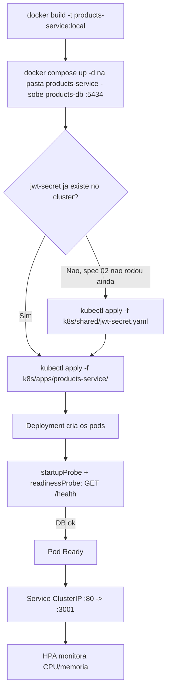

# Spec: Deploy do products-service no cluster local

## Contexto

Com a spec 02 validada, o padrão de manifests (`ConfigMap`, `Secret` próprio, `Secret` compartilhado `jwt-secret`, `Deployment`, `Service`, `HPA`) já está provado no cluster com o `users-service`. Esta spec replica exatamente esse padrão para o `products-service`, o segundo piloto e o primeiro replicado — serve pra confirmar que o padrão realmente generaliza antes de aplicá-lo aos serviços mais complexos (`checkout-service`, `payments-service`), que dependem de RabbitMQ além do banco.

O `products-service` é NestJS + TypeORM, escuta na porta `3001`. Seu `docker-compose.yaml` sobe um Postgres 15 (`products-db`, database `products_db`, usuário/senha `postgres`/`postgres`) exposto em `localhost:5434`. Assim como o `users-service`, expõe um único endpoint de saúde, `GET /health`, checando apenas a conexão com o banco (`TypeOrmHealthIndicator.pingCheck`) — sem endpoint de liveness próprio.

## Objetivo

Colocar o `products-service` rodando no cluster local, reaproveitando o `jwt-secret` compartilhado já criado na spec 02, conectando no Postgres externo, e validado da mesma forma que o `users-service`.

## Requisitos Funcionais

### RF01 — Build da imagem local
Construir a imagem localmente a partir do `Dockerfile` do `products-service`, tag `products-service:local`.

### RF02 — ConfigMap com variáveis não sensíveis
Criar `k8s/apps/products-service/configmap.yaml`: `PORT=3001`, `NODE_ENV=production`, `DB_HOST=host.docker.internal`, `DB_PORT=5434`, `DB_USERNAME=postgres`, `DB_DATABASE=products_db`.

### RF03 — Secret com variáveis sensíveis do próprio serviço
Criar `k8s/apps/products-service/secret.yaml` com `DB_PASSWORD` (base64), mesmo valor de desenvolvimento já usado localmente.

### RF04 — Deployment
Criar `k8s/apps/products-service/deployment.yaml`: mesma estratégia de rollout do `app-ts`/`users-service` (3 réplicas, `RollingUpdate` `maxSurge: 2`/`maxUnavailable: 1`), container na porta `3001`, três `envFrom` (`configmap` do RF02, `secret` do RF03, `secret` compartilhado `jwt-secret` já criado na spec 02 — **não recriar**, apenas referenciar), mesmos `resources.requests`/`limits` de ponto de partida (`cpu: 100m/200m`, `memory: 128Mi/192Mi`).

### RF05 — Probes
`startupProbe` e `readinessProbe` em `GET /health`. Sem `livenessProbe`, mesma justificativa da spec 02 (endpoint depende do Postgres externo).

### RF06 — Service
Criar `k8s/apps/products-service/service.yaml`, `ClusterIP`, porta `80` → `3001`.

### RF07 — HPA
Criar `k8s/apps/products-service/hpa.yaml`, mesmo padrão (CPU 75%, memória 80%, `minReplicas: 3`, `maxReplicas: 8`).

## Fluxo Esperado

## Fora de Escopo

- Trazer o Postgres do `products-service` para dentro do cluster.
- `livenessProbe`.
- Qualquer alteração no código do `products-service`.
- Publicar a imagem em registry externo.
- Ingress ou exposição externa.
- Chamada HTTP do `checkout-service` para o `products-service` (via DNS interno) — validada na spec 04.
- Namespace dedicado, Kustomize, Helm, StatefulSet.

## Critérios de Aceite

1. `docker build -t products-service:local ./marketplace-microservicos/products-service` roda sem erro.
2. `docker compose up -d` na pasta `products-service` sobe o `products-db`, acessível em `localhost:5434`.
3. `kubectl apply -f k8s/apps/products-service/` aplica `ConfigMap`, `Secret`, `Deployment`, `Service` e `HPA` sem erro (assume `k8s/shared/jwt-secret.yaml` já aplicado pela spec 02).
4. `kubectl get pods` mostra os pods do `products-service` em `Running`/`Ready` (`1/1`).
5. `curl`/`port-forward` em `/health` retorna `200 OK`.
6. `kubectl get svc` mostra `ClusterIP` porta `80` → `3001`.
7. `kubectl get hpa` coletando métricas.

## Referências

- `docs/specs/02-users-service-deploy-piloto.md` — padrão de referência já validado.
- `marketplace-microservicos/products-service/docker-compose.yaml`, `.env.example`, `src/health/health.controller.ts`, `Dockerfile`.
