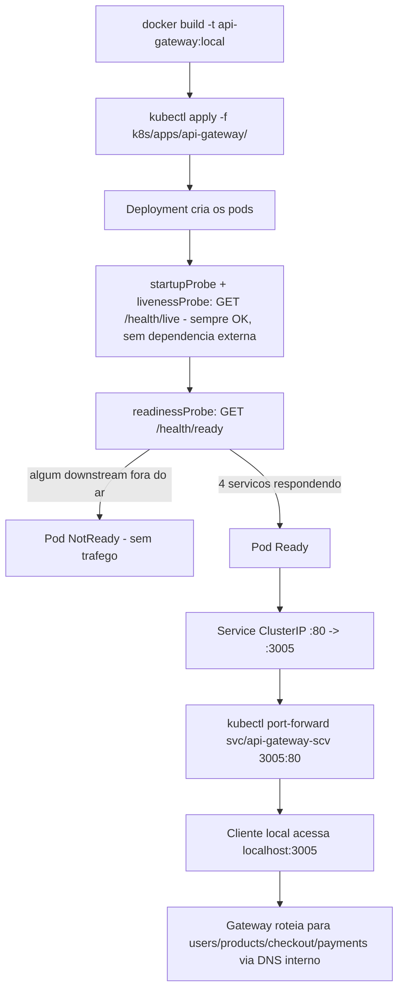

# Spec: Deploy do api-gateway no cluster local

## Contexto

Com `users-service`, `products-service`, `checkout-service` e `payments-service` rodando no cluster (specs 02 a 05), esta spec fecha o conjunto trazendo o `api-gateway` — o único ponto de entrada do sistema (todo tráfego de cliente deve passar por ele, conforme o `README.md`). É a spec que efetivamente conecta os quatro serviços anteriores num sistema único dentro do cluster: o `api-gateway` aponta pra cada um deles pelo nome do `Service` interno (`http://users-service`, `http://products-service`, `http://checkout-service`, `http://payments-service`), em vez de `localhost:<porta>`.

Diferente dos outros quatro serviços, o `api-gateway` **não tem banco próprio** e já expõe endpoints de health corretamente separados:
- `GET /health/live` — liveness pura, só verifica o próprio processo (uptime), sem depender de nada externo.
- `GET /health/ready` (e `GET /health`) — agrega `pingCheck` HTTP contra o `/health` dos 4 serviços downstream.

Isso é a primeira vez, na migração, que dá pra usar o trio completo de probes (`startupProbe`/`readinessProbe`/`livenessProbe`) do jeito que o `app-ts` já usa — nos outros quatro serviços a `livenessProbe` ficou de fora justamente por não existir um endpoint de liveness que não dependesse de infraestrutura externa.

## Objetivo

Colocar o `api-gateway` rodando no cluster, roteando para os 4 serviços via DNS interno, com probes usando corretamente `/health/live` (liveness) e `/health/ready` (readiness) — fechando a migração dos 5 serviços de aplicação do `marketplace-microservicos`.

## Requisitos Funcionais

### RF01 — Build da imagem local
Construir a imagem localmente a partir do `Dockerfile` do `api-gateway`, tag `api-gateway:local`.

### RF02 — ConfigMap com variáveis não sensíveis
Criar `k8s/apps/api-gateway/configmap.yaml`: `PORT=3005`, `USERS_SERVICE_URL=http://users-service`, `PRODUCTS_SERVICE_URL=http://products-service`, `CHECKOUT_SERVICE_URL=http://checkout-service`, `PAYMENTS_SERVICE_URL=http://payments-service`, `CORS_ORIGIN=*`.

### RF03 — Deployment
Criar `k8s/apps/api-gateway/deployment.yaml`: mesmo padrão de rollout (3 réplicas, `RollingUpdate` `maxSurge: 2`/`maxUnavailable: 1`), container na porta `3005`, dois `envFrom` (`configmap` RF02, `secret` compartilhado `jwt-secret` — o `api-gateway` não tem `Secret` próprio, já que não tem banco), mesmos `resources` de ponto de partida.

### RF04 — Probes completas (startup + readiness + liveness)
- `startupProbe` e `livenessProbe`: `GET /health/live` — não depende de nenhum serviço downstream, então nunca reinicia o pod por causa de instabilidade de terceiros.
- `readinessProbe`: `GET /health/ready` — só marca o pod como pronto quando os 4 serviços downstream respondem, o que é o comportamento certo pra um gateway (não adianta receber tráfego se não consegue rotear pra ninguém).

Esse é o padrão completo que ficou pendente nas specs 02 a 05.

### RF05 — Service
Criar `k8s/apps/api-gateway/service.yaml`, `ClusterIP`, porta `80` → `3005`. Continua `ClusterIP` (sem Ingress ou `LoadBalancer`) — acesso de fora do cluster via `kubectl port-forward`, mesmo padrão do `app-ts` hoje.

### RF06 — HPA
Criar `k8s/apps/api-gateway/hpa.yaml`, mesmo padrão (CPU 75%, memória 80%, `minReplicas: 3`, `maxReplicas: 8`).

## Fluxo Esperado

## Fora de Escopo

- Ingress, `LoadBalancer`, qualquer exposição externa nova — permanece `ClusterIP` + `port-forward`.
- Qualquer alteração no código do `api-gateway` (circuit breaker, retry, fallback já existentes não mudam).
- Rate limiting (`RATE_LIMIT_SHORT/MEDIUM/LONG`) — usa os defaults do próprio código, não configurados via ConfigMap nesta etapa.
- Validação end-to-end completa do fluxo de compra via `e2e-flow.sh` — fica pra uma verificação manual posterior, fora do escopo desta spec de infra.
- Namespace dedicado, Kustomize, Helm, StatefulSet.

## Critérios de Aceite

1. `docker build -t api-gateway:local ./marketplace-microservicos/api-gateway` roda sem erro.
2. `kubectl apply -f k8s/apps/api-gateway/` aplica todos os recursos sem erro (assume os 4 serviços downstream já aplicados nas specs 02-05).
3. `kubectl get pods` mostra os pods do `api-gateway` em `Running`/`Ready` (`1/1`) **somente depois** que os 4 serviços downstream também estão `Ready` — confirma que o `readinessProbe` está checando de verdade.
4. Derrubar manualmente um dos 4 serviços downstream (`kubectl scale deployment/<svc> --replicas=0`) faz o `api-gateway` ficar `NotReady` no `readinessProbe`, mas **sem reiniciar** (a `livenessProbe` continua passando) — confirma a separação liveness/readiness.
5. `kubectl port-forward svc/api-gateway-scv 3005:80` + `curl http://localhost:3005/health/ready` retorna o status agregado dos 4 serviços.
6. `kubectl get svc` mostra `ClusterIP` porta `80` → `3005`.

## Referências

- `docs/specs/02-users-service-deploy-piloto.md` a `docs/specs/05-payments-service-deploy.md`.
- `marketplace-microservicos/api-gateway/src/health/health.controller.ts`, `src/health/health.service.ts` — endpoints `/health`, `/health/ready`, `/health/live`.
- `marketplace-microservicos/api-gateway/src/config/gateway.config.ts` — `serviceConfig.*.url`.
- `marketplace-microservicos/api-gateway/.env` — variáveis reais em uso hoje (localhost).
