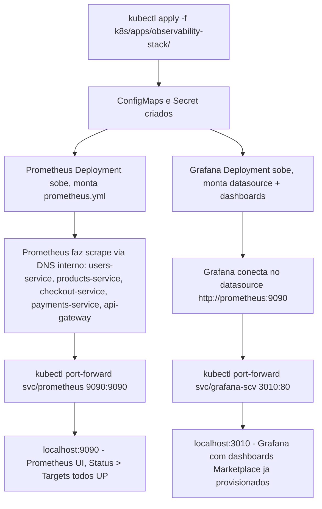

# Spec: Deploy do observability-stack no cluster local

## Contexto

Com os 5 serviços de aplicação (`users`, `products`, `checkout`, `payments`, `api-gateway`) rodando no cluster (specs 02 a 06), o `observability-stack` (Prometheus + Grafana) do `marketplace-microservicos`, hoje via `docker-compose`, **não consegue mais funcionar como está**: seu `prometheus.yml` faz scrape de `host.docker.internal:<porta>`, endereço que só faz sentido quando os serviços rodam no host. Agora que os serviços viraram pods `ClusterIP` dentro do cluster, esse endereço não existe mais pra eles — o Prometheus precisa **entrar no cluster** pra alcançar os serviços pelo DNS interno (`users-service:80/metrics`, etc).

Diferente do Postgres e do RabbitMQ, Prometheus e Grafana não guardam dado de negócio — perder as métricas/dashboards num restart é uma simplificação aceitável pra este estudo (sem PVC nesta etapa). Por isso, mesmo sendo peças "com estado" na prática, elas não caem na mesma régua que adiou Postgres/RabbitMQ pra depois: aqui elas entram direto no cluster, como `Deployment` sem volume persistente.

Uma coincidência favorável: o datasource do Grafana já aponta para `http://prometheus:9090` — exatamente o nome de `Service` que a convenção deste repositório usaria pro Prometheus dentro do cluster. O arquivo de provisionamento do datasource pode ser reaproveitado sem alteração.

Esta spec introduz um mecanismo novo, ainda dentro de um recurso já conhecido: até aqui, `ConfigMap` só foi usado via `envFrom` (variáveis de ambiente). Aqui, o `prometheus.yml`, o `alert.rules.yml` e os arquivos de provisionamento do Grafana precisam existir como **arquivos** dentro do container — isso usa `ConfigMap` como volume montado (`volumeMounts` + `volumes.configMap`), não como `envFrom`. É a mesma peça (`ConfigMap`), um jeito diferente de consumi-la.

## Objetivo

Colocar Prometheus e Grafana rodando no cluster, com o Prometheus fazendo scrape de `/metrics` dos 5 serviços de aplicação via DNS interno, e o Grafana com o datasource do Prometheus e os dois dashboards já existentes (`marketplace-overview.json`, `service-details.json`) provisionados automaticamente.

## Requisitos Funcionais

### RF01 — ConfigMap de configuração do Prometheus
Criar `k8s/apps/observability-stack/prometheus-configmap.yaml` com duas chaves — `prometheus.yml` e `alert.rules.yml` — montadas como arquivo. Conteúdo do `prometheus.yml` igual ao já existente, trocando cada `host.docker.internal:<porta>` pelo nome do `Service` interno de cada aplicação (`users-service:80`, `products-service:80`, `checkout-service:80`, `payments-service:80`, `api-gateway:80`), já que os `Service` de cada app expõem a porta `80` (mapeada pra porta real do container). `alert.rules.yml` copiado sem alteração.

### RF02 — Deployment e Service do Prometheus
Criar `k8s/apps/observability-stack/prometheus-deployment.yaml` (1 réplica — sem HPA nesta etapa, monitoramento não precisa escalar horizontalmente por CPU/memória do jeito que uma API escala) montando o `ConfigMap` do RF01 em `/etc/prometheus/`, porta `9090`, sem volume persistente. Criar `k8s/apps/observability-stack/prometheus-service.yaml`, `ClusterIP`, nome do `Service` = `prometheus` (pra bater com o datasource do Grafana), porta `9090` → `9090`.

### RF03 — ConfigMap de provisionamento do Grafana
Criar `k8s/apps/observability-stack/grafana-configmap.yaml` com o datasource (`grafana/provisioning/datasources/prometheus.yml`, reaproveitado sem alteração — já aponta pra `http://prometheus:9090`) e o provider de dashboards (`grafana/provisioning/dashboards/dashboards.yml`).

### RF04 — ConfigMap com os dashboards JSON
Criar `k8s/apps/observability-stack/grafana-dashboards-configmap.yaml` com o conteúdo de `marketplace-overview.json` e `service-details.json` como chaves separadas, montado no caminho que `dashboards.yml` espera (`/etc/grafana/provisioning/dashboards/json`).

### RF05 — Secret com credenciais de admin do Grafana
Criar `k8s/apps/observability-stack/grafana-secret.yaml` com `GF_SECURITY_ADMIN_USER` e `GF_SECURITY_ADMIN_PASSWORD` (base64), mesmas credenciais de estudo já usadas localmente.

### RF06 — Deployment e Service do Grafana
Criar `k8s/apps/observability-stack/grafana-deployment.yaml` (1 réplica), `envFrom` no `Secret` do RF05, montando os `ConfigMap`s do RF03/RF04 em `/etc/grafana/provisioning/`, porta `3000`, sem volume persistente. Criar `k8s/apps/observability-stack/grafana-service.yaml`, `ClusterIP`, porta `80` → `3000`.

## Fluxo Esperado

## Fora de Escopo

- PersistentVolumeClaim para Prometheus/Grafana — dados voláteis, perdidos em restart (aceitável para estudo nesta etapa).
- Alertmanager (roteamento de alertas) — as regras em `alert.rules.yml` continuam avaliando e aparecendo como firing na própria UI do Prometheus, igual ao setup atual (que também não tem Alertmanager).
- `HorizontalPodAutoscaler` para Prometheus/Grafana.
- Ingress ou exposição externa — acesso via `kubectl port-forward`, mesmo padrão dos demais serviços.
- Alteração de conteúdo dos dashboards (`marketplace-overview.json`, `service-details.json`) — só reaproveitados, não editados.
- Namespace dedicado, Kustomize, Helm.

## Critérios de Aceite

1. `kubectl apply -f k8s/apps/observability-stack/` aplica todos os recursos sem erro.
2. `kubectl get pods` mostra os pods de `prometheus` e `grafana` em `Running`/`Ready`.
3. `kubectl port-forward svc/prometheus 9090:9090` + acessar `localhost:9090/targets` mostra os 5 serviços de aplicação com status `UP`.
4. `kubectl port-forward svc/grafana-scv 3010:80` + login no Grafana com as credenciais do RF05 mostra a pasta "Marketplace" com os dois dashboards (`marketplace-overview`, `service-details`) já provisionados, com dados vindos do Prometheus.
5. Gerar tráfego contra o `api-gateway` (ex.: `curl` manual em algum endpoint) e ver o gráfico correspondente no Grafana atualizar dentro do intervalo de scrape (15s).

## Referências

- `docs/specs/02-users-service-deploy-piloto.md` a `docs/specs/06-api-gateway-deploy.md` — nomes dos `Service` de cada app usados no scrape.
- `marketplace-microservicos/observability-stack/prometheus/prometheus.yml`, `alert.rules.yml`.
- `marketplace-microservicos/observability-stack/grafana/provisioning/` — datasource e dashboards existentes.
- `marketplace-microservicos/observability-stack/docker-compose.yml` — referência do setup atual (fora do cluster).
