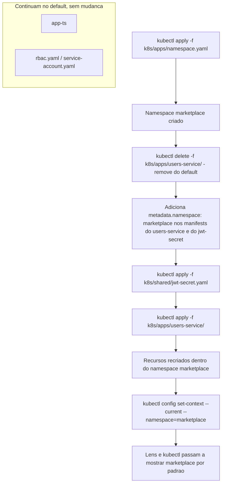

# Spec: Namespace dedicado para o marketplace-microservicos

## Contexto

Até aqui, tudo que foi aplicado no cluster (o `app-ts`, e o `users-service` da spec 02) foi parar no namespace `default`, porque nenhum manifest declara `metadata.namespace`. Com o `marketplace-microservicos` crescendo pra 5 serviços de aplicação + observability-stack, misturar tudo no `default` junto com o `app-ts` (que é só o exemplo de referência que validou o padrão original) e com o material de estudo de RBAC (`rbac.yaml`, `service-account.yaml`, que também não têm relação nenhuma com o marketplace) deixa de fazer sentido — inclusive dificulta visualizar no Lens, que lista recursos por namespace.

Esta spec cria um namespace dedicado, `marketplace`, só para os recursos do `marketplace-microservicos`. **`app-ts` e o material de estudo de RBAC continuam no `default`, sem alteração** — não fazem parte do marketplace, e mover eles seria trabalho sem propósito.

O `users-service` (spec 02) já está aplicado no `default`. Como `namespace` é um campo imutável de um recurso (não dá pra só "editar e aplicar" um `Deployment` já existente pra mudar de namespace), colocar ele no namespace novo exige remover os recursos atuais e reaplicar — isso é feito **junto com a implementação desta spec**, não antes. As specs 03 a 07 (ainda não implementadas) já nascem direto no namespace novo, sem precisar desse passo de remoção.

## Objetivo

Criar o namespace `marketplace` como manifest declarativo (versionado, não criado via `kubectl create namespace` na mão), e estabelecer a convenção de que todo recurso do `marketplace-microservicos` declara `metadata.namespace: marketplace` explicitamente no próprio arquivo — funcionando independente de qual namespace o `kubectl`/Lens está usando como padrão no momento.

## Requisitos Funcionais

### RF01 — Manifest do Namespace
Criar `k8s/apps/namespace.yaml` com o recurso `Namespace`, nome `marketplace`. Fica em `k8s/apps/` (não em `k8s-global/`) porque, embora `Namespace` seja um recurso de escopo de cluster, ele existe especificamente para governar o que está em `k8s/apps/` relacionado ao marketplace — diferente do que já mora em `k8s-global/` (recursos genéricos de cluster, sem relação com nenhum app específico).

### RF02 — Convenção de namespace explícito
Todo recurso namespaced dentro de `k8s/apps/<serviço-do-marketplace>/` e `k8s/shared/` passa a declarar `metadata.namespace: marketplace`. `k8s/apps/app-ts/` e `k8s-global/rbac/` **não** ganham esse campo — continuam sem namespace declarado (== `default`).

### RF03 — Retrofit do users-service já aplicado
Ajustar os 5 manifests do `users-service` (RF02-RF08 da spec 02: `ConfigMap`, `Secret`, `Deployment`, `Service`, `HPA`) adicionando `metadata.namespace: marketplace`. Remover os recursos atuais do `default` (`kubectl delete -f k8s/apps/users-service/`) e reaplicar já no namespace novo. Sem perda de dado real — o Postgres do `users-service` é externo ao cluster.

### RF04 — jwt-secret compartilhado migra junto
`k8s/shared/jwt-secret.yaml` ganha `metadata.namespace: marketplace`, é removido do `default` e reaplicado no namespace novo.

### RF05 — Convenção de kubectl context (documentação, não manifest)
Documentar, no `CLAUDE.md`, o uso de `kubectl config set-context --current --namespace=marketplace` como conveniência **local** (não versionada) para não precisar digitar `-n marketplace` em todo comando do dia a dia — e pra o Lens já abrir focado nesse namespace.

## Fluxo Esperado

## Fora de Escopo

- `ResourceQuota` / `LimitRange` por namespace — não estudado ainda.
- `NetworkPolicy` — não estudado ainda.
- RBAC específico escopado ao namespace `marketplace` — o material de estudo em `k8s-global/rbac/` continua genérico, sem relação com este namespace.
- Mover o `app-ts` ou o material de RBAC para o namespace novo.
- Aplicar o namespace nas specs 03-07 (isso acontece naturalmente quando cada uma for implementada, já nascendo com `metadata.namespace: marketplace` — não é retrabalho desta spec).

## Critérios de Aceite

1. `kubectl get namespace marketplace` existe.
2. `kubectl get all -n marketplace` mostra os recursos do `users-service` (`Deployment`, `Service`, `HPA`, pods) depois do retrofit.
3. `kubectl get pods -n default` não mostra mais nenhum pod do `users-service`.
4. `kubectl get secret jwt-secret -n marketplace` existe; `kubectl get secret jwt-secret -n default` retorna `NotFound`.
5. `kubectl get pods -n default` continua mostrando o `app-ts` normalmente, sem alteração (se estiver aplicado no momento do teste).
6. `GET /health` do `users-service` continua respondendo `200` depois do reapply (confirma que a migração de namespace não quebrou a conexão com o Postgres externo nem com o `jwt-secret`).
7. No Lens, selecionar o namespace `marketplace` (cluster `docker-desktop`) mostra os recursos do `users-service`.

## Referências

- `docs/specs/02-users-service-deploy-piloto.md` — manifests que serão ajustados (RF03).
- `docs/README.md` — decisão "Sem Namespace dedicado" precisa ser atualizada para refletir esta spec quando implementada.
- `CLAUDE.md` — convenção de `kubectl config set-context` (RF05).
